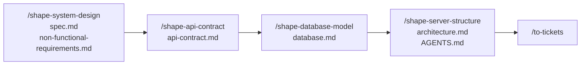

# Skills

Agent skills I use daily, grouped by what they're for. They follow the open [Agent Skills](https://agentskills.io) format, so they work in Cursor, Claude Code, Codex, and any other agent that reads `SKILL.md`.

| Group | Skill | What it does |
| --- | --- | --- |
| [Engineering](#engineering-the-shape-chain) | `/shape-project` and four stages | Shape a backend before building it: requirements, API contract, database, server structure |
| [Productivity](#productivity) | `write-like-henrique` | Draft and edit technical writing in my voice |

## Install

Everything:

```bash
npx skills@latest add HeenriqueCDS/skills
```

One group:

```bash
npx skills@latest add HeenriqueCDS/skills -s shape-project shape-system-design shape-api-contract shape-database-model shape-server-structure
npx skills@latest add HeenriqueCDS/skills -s write-like-henrique
```

## Engineering: the shape chain

Skills that shape a backend product before any code exists. Each stage **grills** you one question at a time, recommends an answer for every question, and writes one design doc. Each doc feeds the next stage.



Not sure where a project stands? Run `/shape-project`. It checks which docs exist and tells you which stage to run next.

| Skill | Grills you on | Writes |
| --- | --- | --- |
| `/shape-project` | Nothing. It is the router. | Nothing |
| `/shape-system-design` | Actors, ownership, entities, rules, calculations, edge cases, then security, auth, cryptography, privacy, scale, cost, observability | `docs/spec.md`, `docs/non-functional-requirements.md` |
| `/shape-api-contract` | Resources, field behaviour, errors, auth transport, idempotency, pagination, versioning, money and date formats, agent (MCP) tools | `docs/api-contract.md` |
| `/shape-database-model` | Tenancy, keys, types, constraints, encrypted columns, deletion, indexes from access patterns, scale, retention | `docs/database.md` |
| `/shape-server-structure` | Deep modules, seams and adapters, dependency rules, errors, transactions, test surface, enforcement | `docs/architecture.md`, `AGENTS.md` |

Every stage also keeps a domain glossary (`CONTEXT.md`) and architecture decision records (`docs/adr/`) up to date as terms and hard-to-reverse choices settle.

### How the chain behaves

- **Earlier docs are optional.** A stage reads every earlier doc that exists and never re-asks what it already settles. When one is missing, the stage asks only what it cannot proceed without, and records those answers as **Assumptions** for the owning stage to confirm later.
- **Rerunning amends.** When a stage's doc already exists, the stage asks what changed and grills only that part.
- **Contradictions go one way.** When an answer contradicts an earlier doc, you decide which side wins, and the earlier doc is fixed in the same session. Later docs are never edited. Instead they are flagged under **Downstream impact**, and the later stage clears the flag when it runs.
- **Every stage has a completion criterion.** Examples: every user story maps to an operation, every invariant is a constraint or an application rule with a reason, every seam has two adapters. The stage isn't finished until the criterion passes.
- **Stack-agnostic, with opinions.** The recommended answers lean on PostgreSQL, REST with RFC 9457 errors, and ports and adapters. You can always answer differently.

### Prerequisites

The chain builds on [Matt Pocock's skills](https://github.com/mattpocock/skills). Install those first:

```bash
npx skills@latest add mattpocock/skills -s grilling domain-modeling codebase-design writing-for-agents
```

Install all five shape skills together: the stages share `engineering/shape-project/CHAIN.md`. They are user-invoked: they run only when you type their name, so they add nothing to the agent's context in other chats.

### Diagrams

Every doc includes a Mermaid diagram, so it's reviewed in git beside the text. When the [Whimsical](https://whimsical.com) MCP server is connected, each stage also offers a Whimsical version:

| Stage | Diagram |
| --- | --- |
| `/shape-system-design` | System context: actors, external systems, trust boundaries |
| `/shape-api-contract` | Sequence diagrams for sign-in, token refresh, idempotent replay |
| `/shape-database-model` | One table per entity, distinct header colours, foreign keys connected |
| `/shape-server-structure` | Module dependency graph, edges labelled by port |

Whimsical is optional. Without it, the Mermaid diagram is all you get.

### Files

Each stage's `SKILL.md` holds the steps, the ordered interview branches, and the completion criterion. `BRANCHES.md` holds what to decide and the recommended default for each branch, with the primary sources behind them: ISO/IEC/IEEE 29148, OWASP ASVS 5.0, NIST SP 800-63B-4, Google AIP, RFC 9110 and 9457, the PostgreSQL docs, Ousterhout, Cockburn, and Evans. `TEMPLATE.md` is the shape of the doc the stage writes.

## Productivity

### `write-like-henrique`

Writes and edits English technical articles, architecture explainers, engineering opinion pieces, LinkedIn posts, and build-in-public updates in my voice: direct, curious, thesis-first, focused on why the trade-off matters. It never invents metrics, incidents, or first-person experiences. Format rules, voice rules, and an editorial checklist live in `references/`.

The agent picks it up on its own when you ask for a draft, rewrite, headline, or adaptation of your technical writing.

## Layout

```text
engineering/
├── shape-project/            SKILL.md (router), CHAIN.md (shared rules for every stage)
├── shape-system-design/      SKILL.md, FUNCTIONAL.md, NON-FUNCTIONAL.md, SPEC-TEMPLATE.md, NFR-TEMPLATE.md
├── shape-api-contract/       SKILL.md, BRANCHES.md, TEMPLATE.md
├── shape-database-model/     SKILL.md, BRANCHES.md, TEMPLATE.md
└── shape-server-structure/   SKILL.md, BRANCHES.md, TEMPLATE.md
productivity/
└── write-like-henrique/      SKILL.md, references/ (voice, formats, editorial checklist)
```

## License

[MIT](LICENSE)
